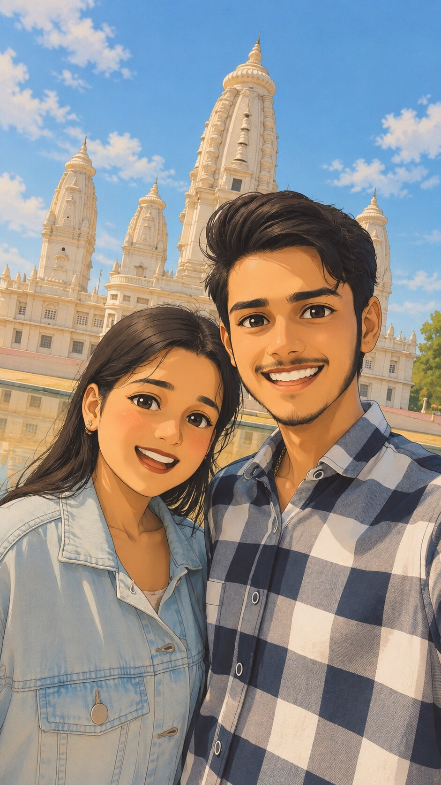
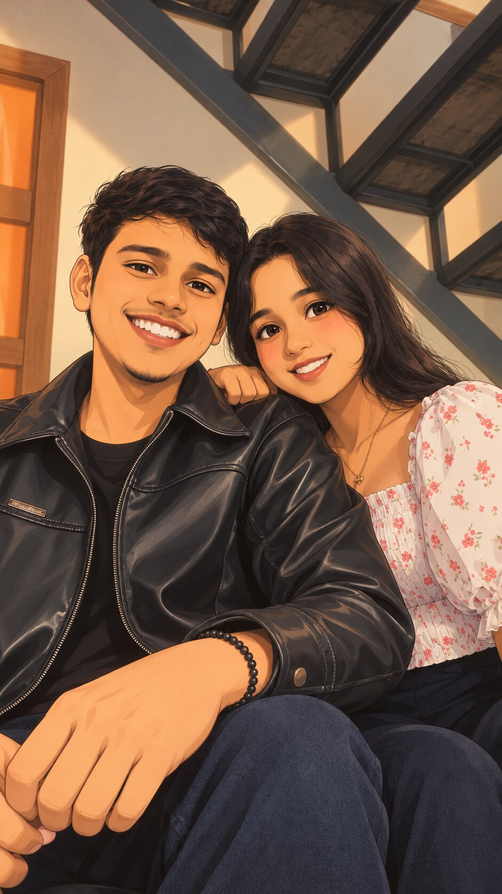
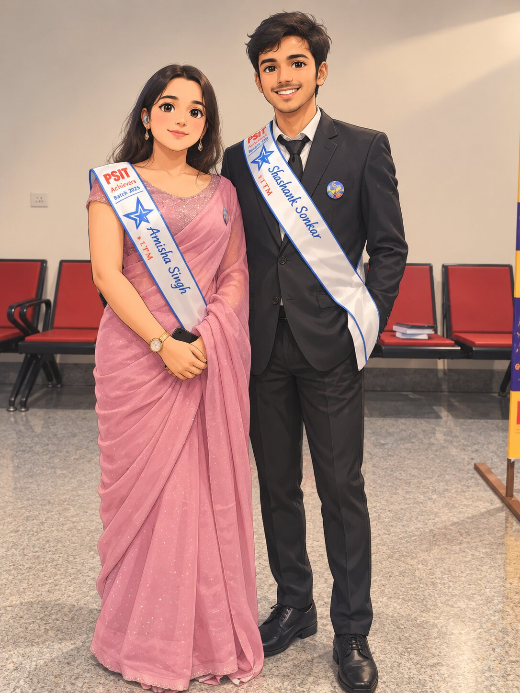

````markdown
# 💕 Happy Anniversary, Amisha ❤️

<p align="center">

  

</p>

<p align="center">

  💌 An interactive digital anniversary surprise created especially for **Amisha**.

</p>

<p align="center">

  <a href="https://sshashank011.github.io/Her/">
    
  </a>

</p>

---

## 🌹 Live Website

<p align="center">

### 💕 Happy Anniversary, My Love Amisha ❤️

**✨ Open the surprise:**

### 👉 [https://sshashank011.github.io/Her/](https://sshashank011.github.io/Her/)

</p>

---

## 💖 About The Project

This project is a **romantic, interactive digital anniversary gift** created using HTML, CSS, and JavaScript.

Instead of giving a traditional card, this website creates a small interactive experience where Amisha can open an animated envelope and discover a personalized collection of messages, memories, surprises, and a digital gift.

The entire project is designed to feel like a **digital love letter** rather than a normal website.

---

# ✨ Features

## 💌 Animated Envelope

The experience begins with a beautiful animated envelope.

Clicking the envelope:

- 💌 Opens the envelope
- ✨ Reveals the surprise
- ❤️ Creates floating hearts
- 🎉 Launches confetti
- ⌨️ Starts the animated love letter

---

## ❤️ Personalized Anniversary Message

The website opens with:

> **Happy Anniversary, My Love Amisha ❤️**

The content is personalized specifically for Amisha.

---

## ⌨️ Typewriter Love Letter

A heartfelt message appears with a smooth typewriter animation.

Example:

> My Beautiful Amisha,
>
> Today is a special day because it reminds me of how lucky I am to have you in my life.
>
> Every moment with you has become a memory that I never want to forget.
>
> Happy Anniversary, My Love. ❤️

---

## 🎁 Digital Gift Card

The website contains a dedicated gift card section.

### Current Gift

🌹 **Spa Day & Dinner**

The gift can easily be changed to:

- 🍽️ Romantic Dinner
- 🛍️ Shopping Spree
- 🎬 Movie Date
- ✈️ Surprise Trip
- 🌹 Spa Day
- 💝 Custom Gift

---

## 📸 Memories Gallery

A dedicated section is available for adding personal photos.

Example:

```text
📸 First Memory
💕 Beautiful Day
🌹 Favorite Moment
````

You can replace the placeholders with your own pictures.

---

## 💕 Open When...

The website includes interactive **Open When** cards.

### 🌧️ Open When You're Sad

A comforting message for difficult days.

### 🥺 Open When You Miss Me

A special message for when we're apart.

### ☀️ Open When You Need A Smile

A small digital happiness boost.

Each card opens inside an animated popup.

---

## 🎵 Background Music

The website supports background music.

Add your music file:

```text
love-song.mp3
```

The website includes a music control button:

```text
🎵
```

You can turn the music on or off.

> ⚠️ Use music that you created yourself or have permission/license to distribute when hosting the website publicly.

---

## 🎉 Confetti Animation

The website creates a celebration effect when:

* 💌 The envelope is opened
* ❤️ The final heart is clicked

---

## 💗 Floating Hearts

Romantic hearts continuously float through the page.

The animation is created completely with CSS and JavaScript.

No external animation library is required.

---

## 💝 Final Surprise

At the end of the website there is a final interactive heart.

Click it to reveal:

> **Happy Anniversary, Amisha ❤️**

followed by a final personal message.

---

# 🛠️ Technologies Used

<p align="center">


</p>

### Core Technologies

* HTML5
* CSS3
* JavaScript
* CSS Animations
* CSS Transitions
* Responsive Web Design
* DOM Manipulation
* HTML Audio API

---

# 🎨 Design

The website uses a romantic and elegant visual theme.

### Color Palette

| Color            | Purpose             |
| ---------------- | ------------------- |
| 🌸 Pastel Pink   | Background          |
| 🌹 Rose          | Primary accent      |
| 🍷 Deep Burgundy | Headings            |
| 🥂 Rose Gold     | Decorative elements |
| 🤍 Cream         | Cards               |
| 💕 Soft Pink     | Highlights          |

### Design Style

* Glassmorphism
* Soft gradients
* Rounded cards
* Romantic typography
* Smooth transitions
* Floating animations
* Responsive layouts

---

# 📱 Responsive Design

The website is optimized for:

* 📱 Mobile phones
* 📱 Tablets
* 💻 Laptops
* 🖥️ Desktop computers

The layout automatically adjusts to different screen sizes.

---

# 📁 Project Structure

```text
Her/
│
├── index.html
│
├── photo1.jpg
├── photo2.jpg
├── photo3.jpg
│
├── love-song.mp3
│
└── README.md
```

---

# 📸 Add Your Photos

Place your photos inside the project folder.

Example:

```text
photo1.jpg
photo2.jpg
photo3.jpg
```

Then replace a placeholder in `index.html`:

```html
<div class="photo-placeholder">
    📸<br><br>
    Our First Memory
</div>
```

with:

```html

```

You can similarly add:

```html

```

and:

```html

```

---

# 🎵 Add Your Music

Place your audio file in the same folder:

```text
love-song.mp3
```

The HTML already contains:

```html
<audio id="music" loop>
    <source src="love-song.mp3" type="audio/mpeg">
</audio>
```

The website provides a button to control the music.

---

# ✏️ Customize The Website

You can easily personalize the website.

## 💕 Change Amisha's Name

Search for:

```html
Happy Anniversary,
<span>My Love Amisha ❤️</span>
```

---

## 💌 Change The Love Letter

Find:

```javascript
const loveLetter = `
...
`;
```

Replace the text with your own personal message.

---

## 🎁 Change The Gift

Find:

```html
<div class="gift-value">
    Spa Day & Dinner
</div>
```

Change it to your actual gift.

For example:

```html
<div class="gift-value">
    ❤️ A Romantic Dinner Date
</div>
```

---

## 💝 Change The Final Message

Find the final surprise section and personalize it.

Example:

```html
<p>

    Happy Anniversary, Amisha. ❤️

    You make my life brighter,
    my days happier,
    and my memories more beautiful.

    I love you. 💕

</p>
```

---

# 🚀 Run Locally

## 1. Clone The Repository

```bash
git clone https://github.com/sshashank011/Her.git
```

## 2. Enter The Project

```bash
cd Her
```

## 3. Open The Website

Open:

```text
index.html
```

in your browser.

No backend or installation is required.

---

# 🌐 GitHub Pages Deployment

This project is hosted using **GitHub Pages**.

### Repository

👉 https://github.com/sshashank011/Her

### Deployment Settings

Go to:

```text
Repository
    ↓
Settings
    ↓
Pages
    ↓
Build and deployment
    ↓
Deploy from a branch
    ↓
main
    ↓
/ (root)
```

Click **Save**.

After deployment, the website is available at:

### 💕 Live Website

👉 **https://sshashank011.github.io/Her/**

---

# 🔗 Important Links

| Resource             | Link                                                 |
| -------------------- | ---------------------------------------------------- |
| 💕 Live Website      | [Open Surprise](https://sshashank011.github.io/Her/) |
| 💻 GitHub Repository | [Her](https://github.com/sshashank011/Her)           |
| 👨‍💻 GitHub Profile | [Shashank Sonkar](https://github.com/sshashank011)   |

---

# 💻 Browser Compatibility

The website works with modern versions of:

* Google Chrome
* Microsoft Edge
* Mozilla Firefox
* Safari
* Opera

---

# 🔐 No Backend Required

This project is completely frontend-based.

```text
HTML
  +
CSS
  +
JavaScript
  +
Images
  +
Music
  ↓
GitHub Pages
  ↓
🌐 Live Website
```

There is:

* ❌ No database
* ❌ No server
* ❌ No API
* ❌ No backend
* ✅ Completely static
* ✅ Free hosting

---

# ❤️ The Story Behind The Project

This isn't just another web project.

It was created as a small digital surprise for someone special.

### 🌹 For Amisha

A collection of:

💌 Words
📸 Memories
🎁 A Gift
💕 Little Messages
🎵 Music
❤️ Love

all brought together in one little website.

---

# 🌸 Special Message

<p align="center">

## Happy Anniversary, Amisha ❤️

### You make ordinary moments feel extraordinary.

### Thank you for being part of my life. 💕

### Here's to more memories, more laughter,

### more adventures, and many more anniversaries together.

## I Love You ❤️

</p>

---

# 👨‍💻 Created By

<p align="center">

### Shashank Sonkar

💻 Computer Science & Engineering
🌐 Frontend Developer
🤖 AI & IoT Enthusiast

GitHub:

**[github.com/sshashank011](https://github.com/sshashank011)**

</p>

---

<p align="center">

🌹 Made with HTML
💕 Styled with CSS
❤️ Animated with JavaScript
✨ Created especially for Amisha

<br><br>

**Happy Anniversary, My Love Amisha ❤️**

</p>
```

Your README will now point directly to your actual live website:

**https://sshashank011.github.io/Her/**

and your actual repository:

**https://github.com/sshashank011/Her**.
